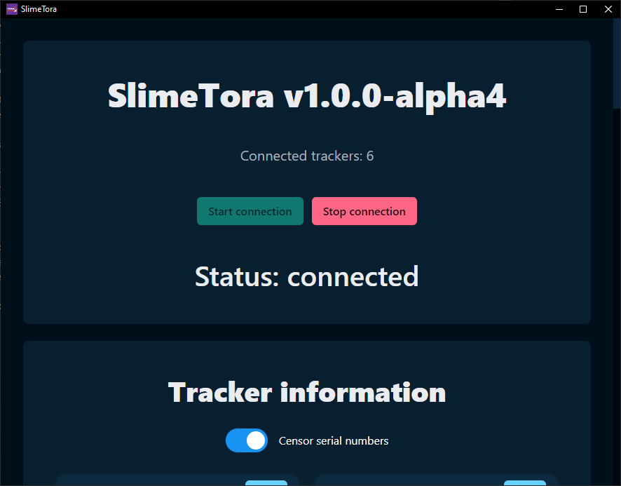
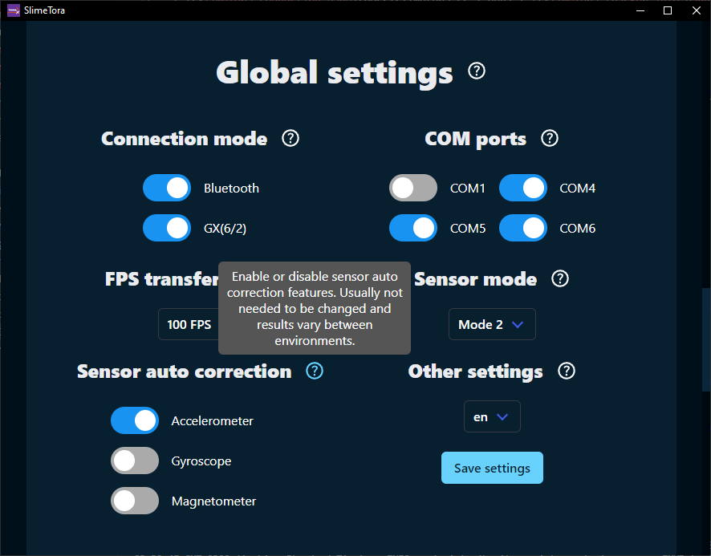
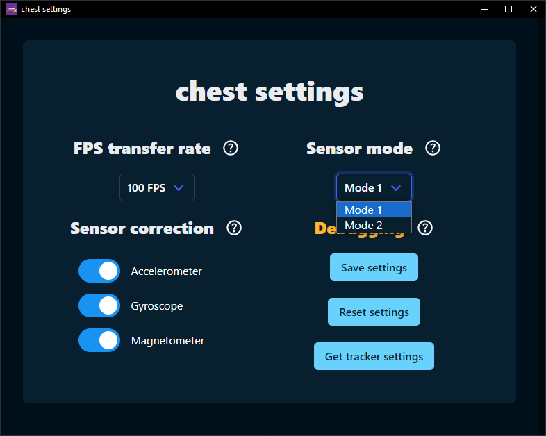
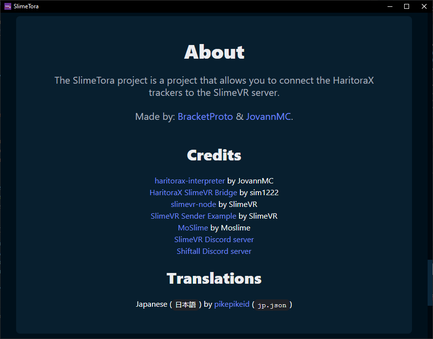
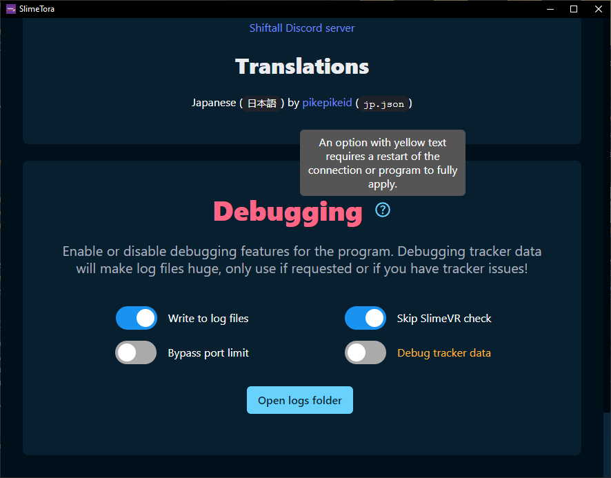
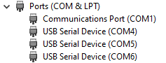

<!--suppress HtmlDeprecatedAttribute -->

# SlimeTora
A program that connects the HaritoraX trackers to the [SlimeVR server](https://docs.slimevr.dev/server/index.html), currently supporting the `HaritoraX Wireless` with other trackers coming soon. Supports `Bluetooth` and the `GX(6/2)` communication dongles.

# Screenshots

| Connection section | Tracker info section |
|:-:|:-:|
|  |  |
|  Global settings section | Per-tracker settings page (chest) |
|  |  |
| About section | Debugging section |
|  |  |

# Features
+ Use of [haritorax-interpreter](https://github.com/JovannMC/haritorax-interpreter) package to process tracker data
+ `Bluetooth` and `GX(6/2)` support (with all at the same time supported)
+ Set tracker settings per-tracker
+ Localization support
  + You can help translate the program! Clone the repo and make a new file under `/src/static/languages/` with a two-letter language identifier (ending with .json, e.g. `jp.json`)!
+ Linux support
  + This was done as SlimeVR is supported on Linux, and the first time HaritoraX trackers work on Linux!
  + ..however this is not tested at all. Please let us know if there are issues.
+ Tracker visualization
+ Magnetometer statuses
+ Censor tracker serial numbers
+ Debugging options
+ ..and many more improvements coming soon!

# Known issues
- (?) GX tracker settings may be unreliable
  - This seems to be really random, unsure if there's something wrong with my testing, device, or if there's a random race condition.
  - Either way, would use `HaritoraConfigurator` instead if you do not need per-tracker settings.
- Battery information is slightly inaccurate on first connection
  - Fixes after the tracker reports the battery information by itself
- Battery data sent to SlimeVR server isn't per-tracker
  - Cannot really fix this, instead the program sends the lowest battery data from all the trackers to the server

# How to use
- Install the [SlimeVR server](https://docs.slimevr.dev/server/index.html)
- Download and run the latest [SlimeTora](https://github.com/JovannMC/SlimeTora/releases/latest) release
- Select the mode to connect to the trackers (BT/GX or both)
- (`GX(6/2)` dongles) Select up up to 4 COM ports that your trackers are on (3 if only using GX6, 4 if using GX6+GX2)
  - Usually, this is the first four (consecutive) available ports. `COM1`/`COM2` are usually already used by other devices, so the ports are likely `COM3`, `COM4`, `COM5` (and `COM6` for GX2)
  - Check `Device Manager` to see what ports are being used by the trackers as `USB Serial Device`s
    
- Start the SlimeVR server
- Turn on your trackers and press `Start connection`
- Assign your trackers in [SlimeVR server](https://docs.slimevr.dev/server/index.html) and enjoy! :)

# Development
- Clone the project - `git clone https://github.com/JovannMC/SlimeTora.git`
- Install the dependencies - `npm i`
- Start the dev environment - `npm start` or `npm run dev`
