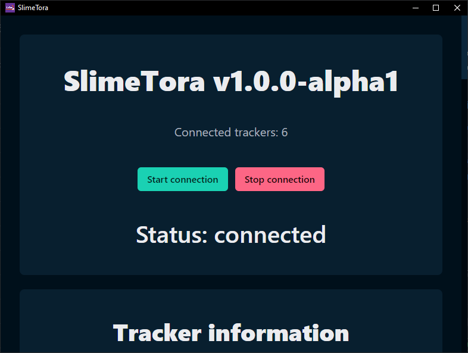
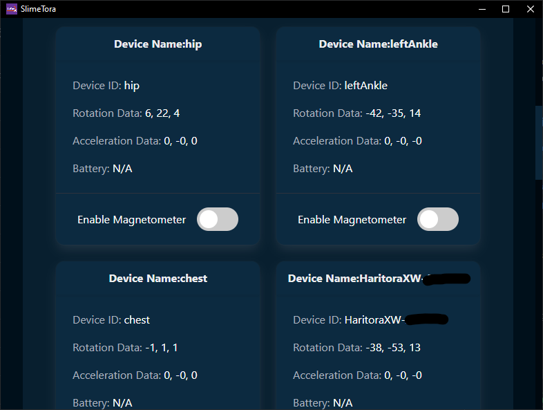

<!--suppress HtmlDeprecatedAttribute -->

# SlimeTora
A program that connects the HaritoraX Wireless trackers to the [SlimeVR server](https://docs.slimevr.dev/server/index.html), supporting Bluetooth and the GX6 communication dongle.

This fork rewrites improves on the stability and performance of the app by rewriting the entire program from scratch; frontend and backend.

# Screenshots

| SlimeTora connection page | SlimeTora tracker info page |
|:-:|:-:|
|  |  |
| SlimeTora settings page | SlimeTora about page |
|  |  |

# New features
+ Entire frontend and backend rewrite (with [Bulma](https://bulma.io/) and [haritorax-interpreter](https://github.com/JovannMC/haritorax-interpreter))
  + The program now has a new UI, the code is cleaner and more maintainable, and should hopefully improve stability/performance.
+ Package app files with `asar`
  + No need to extract thousands of files anymore 😅
+ Bluetooth and GX6 support (including at the same time), with GX2 soon
  + Welcome elbow tracker users!
+ New SlimeTora logo
+ Dynamically grab version number from package.json (instead of relying on manually changing it per release)
+ and many more improvements coming soon!

# Known issues
- `GX2` connection mode option disabled
  - This is coming in the future!
- Tracker auto correction/smoothing/toggle visualization does nothing
  - `v1.0.0-alpha1` does not currently support these options and are coming in the future

# How to use
- Install the [SlimeVR server](https://docs.slimevr.dev/server/index.html)
- Download and run the latest [SlimeTora](https://github.com/JovannMC/SlimeTora/releases/latest) release
- Select the mode to connect to the trackers (BT/GX6 or both)
- (GX6) Select the 3 COM ports that your trackers are on
  - Usually, this is the first three (consecutive) available ports. `COM1`/`COM2` are usually already used by other devices, so the ports are likely `COM3`, `COM4`, and `COM5`
  - Check `Device Manager` to see what ports are being used by the trackers as `USB Serial Device`s

    

- Start the SlimeVR server
- Turn on your trackers and press `Start connection`
- Assign your trackers in SlimeVR and enjoy! :)

Make sure you connect all trackers before assigning the roles in SlimeVR, and go through the usual calibration steps in the SlimeVR software after.

# Development
- Clone the project - `git clone https://github.com/JovannMC/SlimeTora.git`
- Install the dependencies - `npm i`
- Start the dev environment - `npm start`
